# Google Colab ile Ücretsiz GPU kullanımı

### Bu rehber; eğitime hazır, bilgisayar üzerinde oluşturulmuş veri setinin Colab üzerinde eğitimini anlatmaktadır. Tensorflow 1.13.2 kullanılmıştır.

### "test.record, train.record, test images, train images, /training/'model_adi'.config, /training/'labelmap.pbtxt" eğitime başlamak için hazır şekilde bulunmalıdır. Eğitiminiz bu seviyede değilse internet üzerinden "Tensorflow Object Detection API ile Obje Bulma" dokumanlarından yararlanabilirsiniz.

#### Google Colaboratory(_Colab_), GPU kullanarak çeşitli makine öğrenme algoritmalarıyla veri işlemeyi hesaplayabilen ve açık bir platformdur. Kullanımı kolay, hesaplaması hızlı ve ücretsizdir.  Ancak Colab'in bir dezavantajı vardır. Colab'ı her zaman ve her gün kullanamazsınız. Buna sürekli olarak 12 saat erişebilirsiniz. Daha sonrasında çalıştırdığınız Script durur ve CPU ile devam edersiniz. Kişisel Google Drive'ınızı Colab'e bağlayarak bu kullanıcı deneyimine sahip olabilirsiniz. 

#
   
__- Öncelikle Google Drive'a giriş yapıyoruz.__
[Google Drive](https://www.google.com/intl/tr/drive/)

<p align="center">
  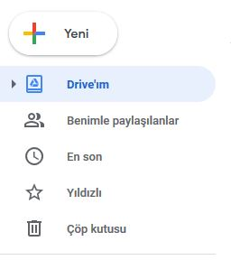
</p> 

## 1. Drive'da klasör oluşturma

Colab Google Drive'ınız üzerinde çalışmaktadır. Öncelikle Drive'da kullanacağımız klasörümüzü oluşturalım. "Yeni" seçeneğine tıkladıktan sonra "Klasör" seçeneğine tıklıyoruz. Açılan pencerede klasörümüze bir isim belirliyoruz. Ben "TensorflowQ" isminde bir klasör oluşturdum. Siz farklı bir isimle de oluşturabilirsiniz fakat kullacağımız scriptlerde dizin yolunu bu isimle verdiğim için tek tek hepsini değiştirmek zorunda kalacaksınız. 
   
<p align="center">
  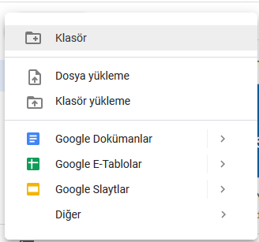
</p> 

<p align="center">
  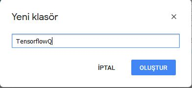
</p> 

<p align="center">
  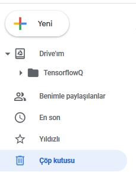
</p> 

## 2. Dosyaları yükleme
Dosyalarımızı yüklemeden önce modelin config dosyasında değişiklik yapmak gerekiyor. Bilgisayarımızda model dosyalarımızı oluşturduğumuz dizine giderek "/models/research/object_detection/training" yolunu takip ediyoruz. "model_adi.config" dosyasını not defteri ile açarak aşağıdaki satırları belirtildiği gibi değiştiriyoruz. 

### fine_tune_checkpoint için,
__fine_tune_checkpoint: "/content/drive/TensorflowQ/models/research/object_detection/ssd_mobilenet_v2_coco_2018_03_29/model.ckpt"__\
__DİKKAT: *Burada "ssd_mobilenet_v2_coco_2018_03_29" yerine kullandığınız modelin "/models/research/object_detection/" klasörü içerindeki adını yazınız.*__

### train_input_reader'ın alt satırları için,
__input_path: "/content/drive/TensorflowQ/models/research/object_detection/train.record"__

__label_map_path: "/content/drive/TensorflowQ/models/research/object_detection/training/labelmap.pbtxt"__

### eval_input_reader'ın alt satırları için,
__input_path: "/content/drive/TensorflowQ/models/research/object_detection/test.record"__

__label_map_path: "/content/drive/TensorflowQ/models/research/object_detection/training/labelmap.pbtxt"__
#
Oluşturduğumuz "TensorflowQ" klasörünün içerisine giriyoruz. Tekrar "Yeni" butonuna tıklayarak "Dosya yükleme" seçeneğini seçiyoruz. Hazırda bulunan Tensorflow ile ilgili dosyalarımızı "models" klasörü ile yüklüyoruz.

<p align="center">
  
</p> 

<p align="center">
  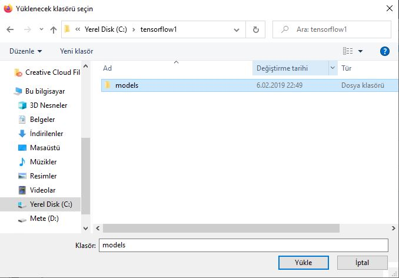
</p> 


## 3. Colaboratory uzantısını yükleme
Google Drive üzerinde yeni bir notebook oluşturmak için öncelikle Colaboratory uzantısını yüklemek gerekiyor. Bunun için oluşturduğumuz "TensorflowQ" klasörünün içine giriyoruz. Daha sonra boş alana sağ tıklayarak menüyü açıyoruz. "Diğer" seçeneğinin üzerine gelerek "Daha fazla uygulama bağla" seçeneğine tıklıyoruz. Karşımıza gelen bölümde üst tarafta arama kısmına "Colaboratory" yazarak uygulamayı aratıyoruz. Uygulamanın üzerine tıkladıktan sonra "Yükle" diyerek uygulamamızı yüklüyoruz.

Aşağıdaki resimlerde de basit şekilde gösterimi mevcuttur.
<p align="center">
  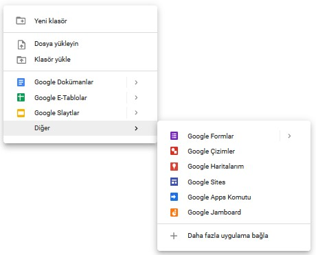
</p> 
<p align="center">
  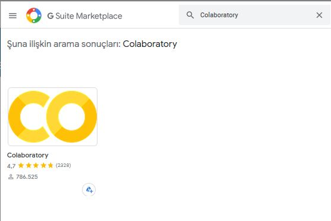
</p> 
<p align="center">
  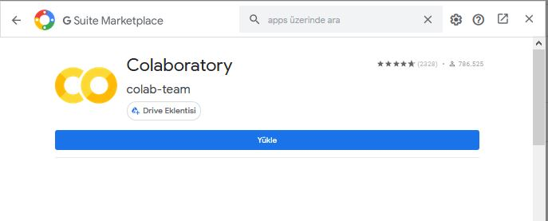
</p> 

## 4. Yeni notebook oluşturma
"TensorflowQ" klasoründe olduğumuz kontrol etikten sonra tekrar boş alana sağ tıklayarak menüyü açıyoruz. "Diğer" seçeneğinin üzerine gelerek "Google Colaboratory" seçeneğine tıklıyoruz. Bizi Colab üzerine bağlayacak ve notebook'umuz oluşturulacak. "Untitled0.ipynb" ismini dilediğimiz şekilde değiştirebiliriz, ben "egitim.ipynb" olarak değiştirdim. Artık burası bizim '.py' uzantılı python dosyalarımızı çalıştıracağımız ortamımızdır.

<p align="center">
  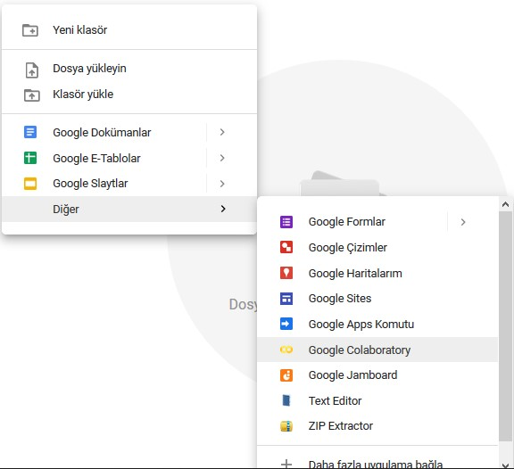
</p> 
<p align="center">
  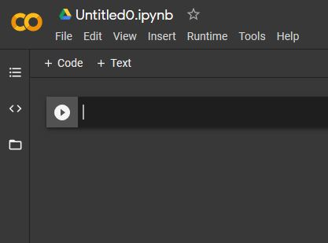
</p> 
<p align="center">
  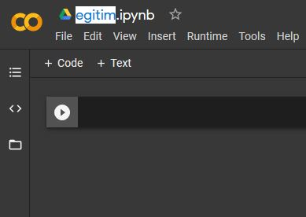
</p> 


## 5. GPU’yu ayarlama
Notebook üzerinde Runtime >> Change runtime type yolunu izleyerek aşağıda görünen ekrana ulaşıyoruz. Bu ekranda "Hardware accelerator" kısmı GPU olacak şekilde değiştiriyoruz. "Save" diyerek GPU seçimini tamamlıyoruz.

<p align="center">
  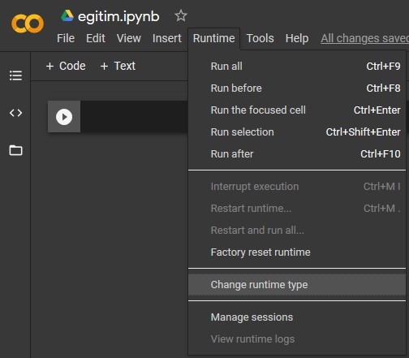
</p> 
<p align="center">
  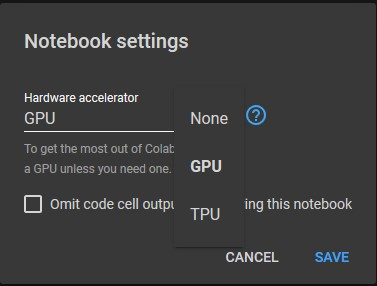
</p> 
   
## 6. Eğitime başlamak için gerekli kurulumlar

Kodları __+Code__ yazan yere tıklayarak alt alta bölmeler oluşturarak ayrı ayrı çalıştırmanızda fayda var. Verilen kod parçalarını bu bölümlere verilen sırayla yapıştırarak çalıştıracağız. 
<p align="center">
  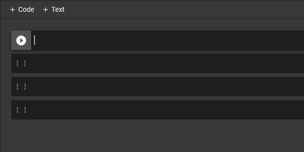
</p>

__- Kodlarınızı Colab'ın dizinine bağlamak için, önce Google Drive ile basit kodla bağlantı kurmanız gerekir.__
<p align="center">
  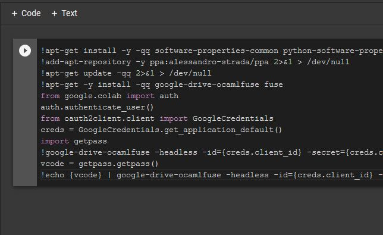
</p>

Kodu çalıştırdıktan sonra karşımıza sırayla iki adet link gelecek. Gelen linke tıklayarak doğrulama kodumuzu alıyoruz. Doğrulama kodunu "Enter Verification Code" yazan yere yapıştırıp Enter'a basıyoruz. Daha sonrasında diğer link gelecek karşımıza. Yine aynı şekilde linke tıklayarak doğrulama kodumuzu alyoruz ve aynı yere yapıştırıp gönderiyoruz.

```
!apt-get install -y -qq software-properties-common python-software-properties module-init-tools
!add-apt-repository -y ppa:alessandro-strada/ppa 2>&1 > /dev/null
!apt-get update -qq 2>&1 > /dev/null
!apt-get -y install -qq google-drive-ocamlfuse fuse
from google.colab import auth
auth.authenticate_user()
from oauth2client.client import GoogleCredentials
creds = GoogleCredentials.get_application_default()
import getpass
!google-drive-ocamlfuse -headless -id={creds.client_id} -secret={creds.client_secret} < /dev/null 2>&1 | grep URL
vcode = getpass.getpass()
!echo {vcode} | google-drive-ocamlfuse -headless -id={creds.client_id} -secret={creds.client_secret}
```


## - Drive'ımızı Colab'e bağlıyoruz.
<p align="center">
  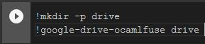
</p> 

```
!mkdir -p drive
!google-drive-ocamlfuse drive
```


## - PythonPATH ayarlama
<p align="center">
  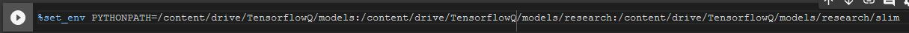
</p>

```
%set_env PYTHONPATH=/content/drive/TensorflowQ/models:/content/drive/TensorflowQ/models/research:/content/drive/TensorflowQ/models/research/slim
```

## - Tensorflow Kurulumu
<p align="center">
  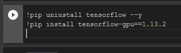
</p>

```
!pip uninstall tensorflow --y
!pip install tensorflow-gpu==1.13.2
```

## - CUDA 10 kurulumu
<p align="center">
  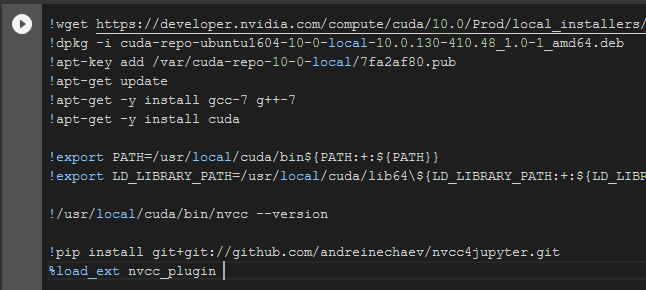
</p>

```
!wget https://developer.nvidia.com/compute/cuda/10.0/Prod/local_installers/cuda-repo-ubuntu1604-10-0-local-10.0.130-410.48_1.0-1_amd64 -O cuda-repo-ubuntu1604-10-0-local-10.0.130-410.48_1.0-1_amd64.deb
!dpkg -i cuda-repo-ubuntu1604-10-0-local-10.0.130-410.48_1.0-1_amd64.deb
!apt-key add /var/cuda-repo-10-0-local/7fa2af80.pub
!apt-get update
!apt-get -y install gcc-7 g++-7
!apt-get -y install cuda 

!export PATH=/usr/local/cuda/bin${PATH:+:${PATH}}
!export LD_LIBRARY_PATH=/usr/local/cuda/lib64\${LD_LIBRARY_PATH:+:${LD_LIBRARY_PATH}}

!/usr/local/cuda/bin/nvcc --version

!pip install git+git://github.com/andreinechaev/nvcc4jupyter.git
%load_ext nvcc_plugin 
```

## - Numpy sıkıntıları için uygun sürümlerin kurulumu.
<p align="center">
  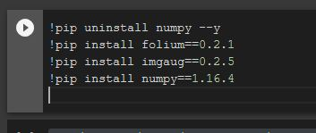
</p>

__Birkaç uyarı verebilir sıkıntı değil.__

```
!pip uninstall numpy --y
!pip install folium==0.2.1
!pip install imgaug==0.2.5
!pip install numpy==1.16.4
```

## - Kurduğumuz kütüphanelerin sürüm kontrolünü sağlamak için.
<p align="center">
  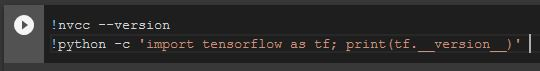
</p>

```
!nvcc --version
!python -c 'import tensorflow as tf; print(tf.__version__)' 
```
__Komut çıktısı aşağıdaki gibi ise sorunsuz biçimde eğitime başlanabilir.__
<p align="center">
  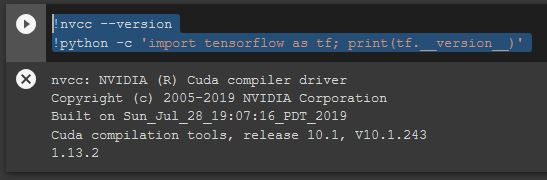
</p>


## - Eğitime başlama.
<p align="center">
  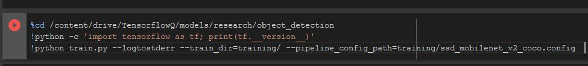
</p>

__Aşağıdaki kodda bulunan "--pipeline_config_path=training/ssd_mobilenet_v2_coco.config" kısmında "ssd_mobilenet_v2_coco" yerine kendi kullandığınız modelin "/models/research/object_detection/training" klasöründeki config dosyasının adını yazıyoruz. Benim kullandığım model bu.__

__Eğer veri setinizi doğru oluşturmuş ve adımları doğru takip etmişseniz eğitim birkaç dakika içinde başlayacaktır.__

__UYARI: Eğitimler belirli adımlarla kaydedilmektedir. Eski eğitim adımları ise otomatik olarak silinmektedir. Silinen eski adımlar Drive içersinde "Çöp kutusu"na gitmektedir. Ara sıra "Çöp kutusu"nu temizlememek Drive alanının dolmasına neden olur.__

```
%cd /content/drive/TensorflowQ/models/research/object_detection
!python -c 'import tensorflow as tf; print(tf.__version__)'
!python train.py --logtostderr --train_dir=training/ --pipeline_config_path=training/ssd_mobilenet_v2_coco.config
```

## - Eğitim sonucundaki modeli kullanılabilir hale getiremek için:
<p align="center">
  
</p>
<p align="center">
  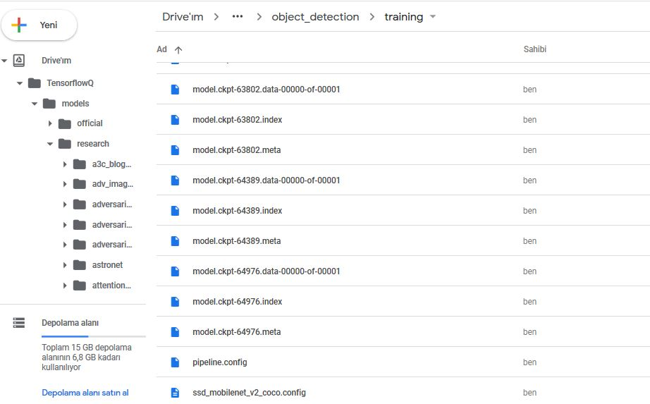
</p>

__Aşağıdaki kodda bulunan "--pipeline_config_path=training/ssd_mobilenet_v2_coco.config" kısmında "ssd_mobilenet_v2_coco" yerine kendi kullandığınız modelin "/models/research/object_detection/training" dizinindeki modelin config dosyasının adını yazıyoruz. Benim kullandığım model "ssd_mobilenet_v2_coco".__

__Aşağıdaki kodda bulunan "--trained_checkpoint_prefix training/model.ckpt-XXXXX" kısmı için Drive'daki "TensorflowQ" klasörümüzü takip edelim. "/TensorflowQ/models/research/object_detection/training" dizinine ulaşalım. "XXXXX" yerine klasörde gördüğümüz "model.ckpt" ların en büyük eğitim adımını yazıyoruz. Ben eğitimimi 64976 adım sürdürmüşüm, bu değeri "XXXXX" yerine yazacağım.__

__Birkaç dakika süren işlem sonunda eğitilmiş modeliniz Drive içinde "TensorflowQ/models/research/object_detection/inference_graph" klasöründe oluşacaktır. Bu klasöre "TensorflowQ/models/research/object_detection/" içerisinde sağ tıklayıp indir diyerek rar'lı bir biçimde klasör bilgisayarınıza indirebilirsiniz.__

```
%cd /content/drive/TensorflowQ/models/research/object_detection
!python export_inference_graph.py --input_type image_tensor --pipeline_config_path training/ssd_mobilenet_v2_coco.config --trained_checkpoint_prefix training/model.ckpt-XXXXX --output_directory inference_graph
```
